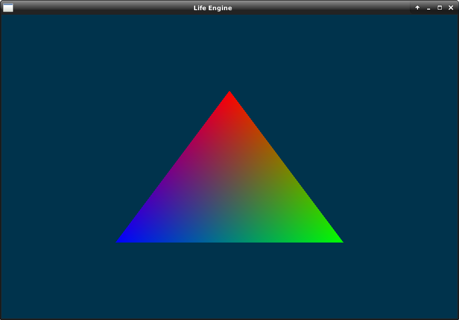

# Life Engine v4
Life Engine is a for-fun game engine. This will likely not become anything.

## Build
Development is being done on Linux so there is no official support for non-linux compilation pipelines.
```bash
# install dependencies
sudo apt-get install libglew-dev libassimp-dev libglfw3-dev libglm-dev --install-recommends
# usual cmake procedure
cmake -B build
cmake --build build
```

## Latest Screenshot

